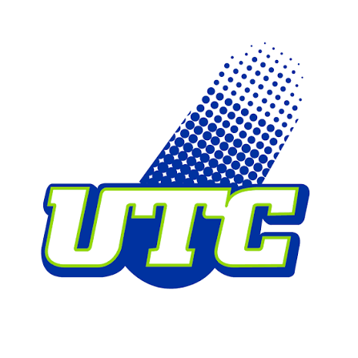
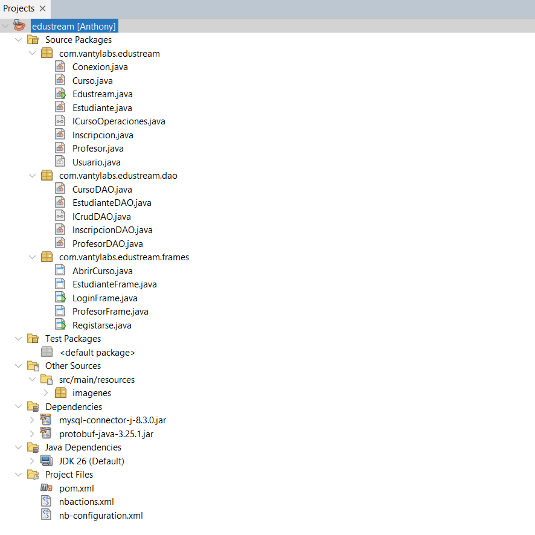
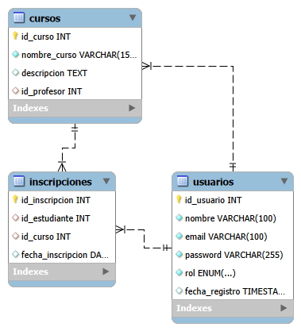

# EDUSTREAM LMS (Edición G4 - Programación II)

> Proyecto universitario realizado para el curso de Programación II de la Universidad Tecnológica Costarricense.

<div align="center">
    
</div>

## Descripción:

Es una plataforma de gestión académica o Learning Management System (LMS). Desarrollado de manera simplificada utilizando Java SE, una base de datos MySQL con servidor local e paneles interactivos mediante Jframes como una aplicación de escritorio.

**Objetivos Técnico:**

1. Adecuada persistencia de datos mediante el patrón DAO y la configuración de la clase de conexión con el JDBC.
2. Orden y consistencia entre clases, abstractas. Con manejo adecuado de la herencia y el encapsulamiento.
3. Interacción dinámica y fluida mediante la implementación de interfaces, sus elementos y propiedades.

**Objetivos Técnico:**

1. Demostrar el entendimiento y capacidad de aplicación de los conceptos de Java SE vistos durante el curso.
2. Implementantar una arquitectura profesional haciendo uso de los estándadares de la programación orientada a objetos.

---

## Tabla de Contenidos

1. [Información General](#-información-general)
2. [Características Principales](#-características-principales)
3. [Arquitectura y Tecnologías](#-arquitectura-y-tecnologías)
4. [Requisitos del Sistema](#-requisitos-del-sistema)
5. [Instalación y Configuración](#-instalación-y-configuración)
6. [Ejecución](#-ejecución)
7. [Estructura del Proyecto](#-estructura-del-proyecto)
8. [Casos de Uso / Roles de Usuario](#-casos-de-uso--roles-de-usuario)
9. [Diseño de Base de Datos](#-diseño-de-base-de-datos)
10. [Equipo de Desarrollo](#-equipo-de-desarrollo)
11. [Licencia / Información Académica](#-licencia--información-académica)

---

## Información General

- **Institución:** [Universidad Tecnológica Costarricense]
- **Curso / Asignatura:** [Programación II]
- **Periodo Lectivo:** [Segundo Cuatrimestre 2026]
- **Profesor(a):** [Ing. Pablo Cordero Vega]

---

## Características

- Gestión de Usuarios mediante autenticación por contranseña.
- División de roles (Profesor/Estudiante) con sus respectivos espacios y acciones.
- Creación y gestión de cusos para el rol de Profesor.
- Información general de curso para el rol de Estudiante.

---

## Arquitectura y Tecnologías

- **Entorno de Programación:** NetBeans
- **Lenguaje de Programación:** Java (Versión [JDK 26/25])
- **Gestión de Dependencias:** Maven
- **Base de Datos:** MySQL
- **Patrón de Arquitectura:** Arquitectura en Capas + DAO

---

## Requisitos del Sistema

### Prerrequisitos

- **JDK:** Versión [22] o superior.
- **IDE Recomendado:** [NetBeans / VS Code].
- **Gestor de Base de Datos:** MySQL Server.
- **Gestor de Construcción:** Apache Maven.

---

## Instalación y Configuración

### 1. Clonar el repositorio

```bash
git clone https://github.com/usuario/nombre-del-proyecto.git
cd nombre-del-proyecto
```

o en NetBeans **Team -> Clone repository...**

### 2. Configurar la Base de Datos

1. Crear la base de datos local ejecutando el script SQL: [edustream.sql](edustream.sql)
2. Configurar credenciales en el archivo de propiedades: [conexion.java](/src/main/java/com/vantylabs/edustream/Conexion.java)
3. Conectar con el JDBC en NetBeans **Services -> Databases -> Seleccionar o crear conexión con MySQL Server**

### 3. Compilar y ejecutar el proyecto

```bash
mvn clean install
```

```bash
-Dexec.mainClass="com.edustream.java"
```

o en Netbeans **Compile & Run Project**

## _Los archivos de dependencias ya se encargan con configurar el entorno en NetBeans_

## Estructura del Proyecto



---

## Roles de Usuario

- **Profesor / Instructor:** Puede ver los estudiantes matriculados el los cursos y crear un nuevo curso.
- **Estudiante:** Puede ver la información general de los cursos y matricularse en ellos.

---

## Diseño de Base de Datos

### **Diagrama ER:**



### **Diccionario de Datos:**

[Ir al diccionario](./docs/diccionario_db.csv)

---

## Equipo de Desarrollo

| Nombre Completo  | Rol en el Proyecto   | GitHub                                        |
| :--------------- | :------------------- | :-------------------------------------------- |
| Anthony Alfaro   | [Backend / DB]       | [@github](https://github.com/AnthonyAlfaro25) |
| Byron Coto       | [Backend / Frontend] | [@github](https://github.com/cotobeja-source) |
| Fabricio Ortiz   | [Backend / DB]       | [@github](https://github.com/Mochismireina)   |
| Manuel Hernández | [Backend / QA]       | [@github](https://github.com/Mhm89)           |

---

## Licencia

Este proyecto ha sido desarrollado con fines académicos como parte de la evaluación del curso **Programación II**.
